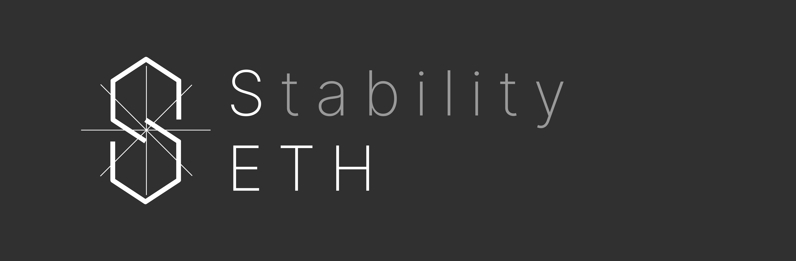

  

  

# SETH ♢

StabilityETH (SETH) is an independent project inspired by Wrapped ETH, with a key difference: it turns TVL into an additional source of revenue for verified applications on both EVM and non-EVM chains.

## Key Features

- **1:100 Minting Ratio** — SETH can be minted at a 1:100 ratio to native ETH on any supported chain.

- **Performance Based Returns (PBR)** — Verified applications generate yield proportionally to their relative TVL.

- **Omnichain Asset** — SETH maintains its 1:100 collateralization rate across all chains during cross-chain transfers.

- **Open Eligibility** — All dApps are eligible for PBR if they meet the eligibility criteria.

## How It Works

SETH is fully collateralized by ETH at a 100:1 ratio (1 SETH = 0.01 ETH). Cross-chain transfers preserve this collateralization regardless of message arrival order. Verified applications receive Performance Based Returns in proportion to their share of total TVL, which does not rely on SETH holdings and instead can include any token staked in any contract, as long as the token has a market cap above $100m and the contract has a TVL above $100k.

## Registration

Visit [StabilityETH](https://stability-eth.io/registry/) to verify a dApp and start earning Performance Based Returns (PBR). New EVM chains can be deployed automatically from the UI.

## Contact

The primary security contact for StabilityETH is security@islalabs.co.